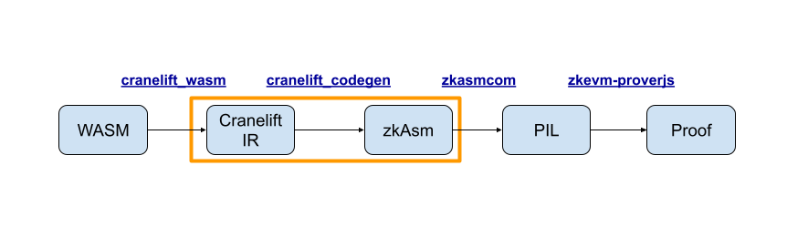

# Architecture

This document described high-level architecture of zkAsm backend as well as how it fits into the rest of the pipeline that enables Zero-knowledge proofs for WASM programs.

## Technical setup

zkAsm backend is implementing a [new ISA](https://docs.rs/cranelift-codegen/latest/cranelift_codegen/isa/index.html) from Cranelift's point of view. It was originally based on [Riscv64 ISA](https://github.com/near/wasmtime/tree/main/cranelift/codegen/src/isa/riscv64), but is actively [being decoupled](https://github.com/near/wasmtime/issues/20) from it.

This allows us to build the following pipeline:
1. Convert WASM program to Cranelift IR using [cranelift_wasm](https://docs.rs/cranelift-wasm/latest/cranelift_wasm/)
2. Optimize and compile Cranelift IR to zkAsm using [cranelift_codegen](https://docs.rs/cranelift-codegen/latest/cranelift_codegen/) and our zkAsm backend
3. Compile zkAsm to PIL polynomials with [zkasmcom](https://github.com/0xPolygonHermez/zkasmcom)
4. Generate the proof using [zkevm-prover](https://github.com/0xPolygonHermez/zkevm-prover)

## Design constraints

The quality of the generated code is very important, as some zkAsm programs are much more efficient to prove than others.
We care about both backend-independent compiler optimizations as well as optimizations during lowering.

We do not care about compilation speed and ready to trade it off for higher compilation quality, as the intended usecases will repeatedly prove the result of execution of a small set of programs and the compilation cost will be paid only once and will likely be negligible compared to the proving costs.

## zkAsm

zkAsm is a register machine with memory that is programmed in a [textual assembly language](https://wiki.polygon.technology/docs/zkevm/zkASM/basic-syntax/).
It has around [30 instructions](https://github.com/0xPolygonHermez/zkasmcom/blob/main/instructions.md) and a formal [machine spec](https://github.com/0xPolygonHermez/zkevm-techdocs/blob/main/zkevm-architecture/v.1.1/zkevm-architecture.pdf).

It has some notable differences from traditional ISAs:
- ZK processor is [fully defined in software](https://github.com/0xPolygonHermez/zkevm-proverjs/blob/main/pil/main.pil) in a language called [PIL](https://github.com/0xPolygonHermez/zkevm-techdocs/blob/main/pil/v.1.0/pil.pdf) which is well suited for generating ZK proofs. As a consequence, we have a lot of freedom to change it as we see fit (as long as it is still cheap to prove)
- The relative costs of many instructions are very different from traditional ISAs:
    - Bitwise operations (AND, OR, XOR, NOT) are 4-16 times more expensive than arithmetic operations (ADD, SUB, NEG)
    - Random memory access is cheap

Some relevant tooling to work with zkAsm:
- Simulators in [JavaScript](https://github.com/0xPolygonHermez/zkevm-proverjs) and [C++](https://github.com/0xPolygonHermez/zkevm-prover)
- [Text Assembly Parser](https://github.com/0xPolygonHermez/zkasmcom)

## Why Cranelift and alternatives considered

Here are the qualities of Cranelift compiler make it a good fit for this task:
- Cranelift -> WASM is a well-supported path with high-quality optimization passes
- Cranelift ISLE provides a flexible model for writing lowering rules which would allow us to incrementally improve the quality of generated code and experiment with different zkAsm architectures
- Cranelift supports [tools for formal verification](https://www.cs.cornell.edu/~avh/veri-isle-preprint.pdf) of lowering rules which is especially important in ZK context

We also considered a few other alternatives:

### Direct WASM -> zkAsm compilation

We’ve built a [prototype](https://github.com/akashin/zkwasm/) for this approach and discovered the following trade-offs:

Pros:
- Easy to work with, simple and small codebase

Cons:
- Hard to generate efficient code, need to implement all standard compiler optimizations
- Larger instruction set to support: WASM is around 400 instructions today, while Cranelift IR is only 100

### LLVM

Pros:
- Mature codebase
- Supports a lot of different architectures, so will likely support ours

Cons:
- Hard to work with (build times, complexity, C++)
- No first-class support for WASM

See [Zulip thread](https://near.zulipchat.com/#narrow/stream/295306-pagoda.2Fcontract-runtime/topic/llvm.20backend.20for.20zk/near/389232792) for the related discussion.
