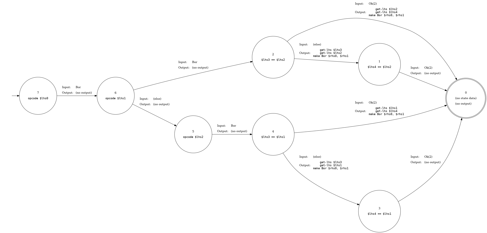

<div align="center">
  <h1><code>peepmatic</code></h1>

  <p>
    <b>
      <code>peepmatic</code> is a DSL and compiler for peephole optimizers for
      <a href="https://github.com/bytecodealliance/wasmtime/tree/master/cranelift#readme">Cranelift</a>.
    </b>
  </p>

  

</div>

<!-- START doctoc generated TOC please keep comment here to allow auto update -->
<!-- DON'T EDIT THIS SECTION, INSTEAD RE-RUN doctoc TO UPDATE -->


- [About](#about)
- [Example](#example)
- [A DSL for Optimizations](#a-dsl-for-optimizations)
  - [Variables](#variables)
  - [Constants](#constants)
  - [Nested Patterns](#nested-patterns)
  - [Preconditions and Unquoting](#preconditions-and-unquoting)
  - [Bit Widths](#bit-widths)
- [Implementation](#implementation)
  - [Parsing](#parsing)
  - [Type Checking](#type-checking)
  - [Linearization](#linearization)
  - [Automatization](#automatization)
- [References](#references)
- [Acknowledgments](#acknowledgments)

<!-- END doctoc generated TOC please keep comment here to allow auto update -->

## About

Peepmatic is a DSL for peephole optimizations and compiler for generating
peephole optimizers from them. The user writes a set of optimizations in the
DSL, and then `peepmatic` compiles the set of optimizations into an efficient
peephole optimizer:

```
DSL ----peepmatic----> Peephole Optimizer
```

The generated peephole optimizer has all of its optimizations' left-hand sides
collapsed into a compact automata that makes matching candidate instruction
sequences fast.

The DSL's optimizations may be written by hand or discovered mechanically with a
superoptimizer like [Souper][]. Eventually, `peepmatic` should have a verifier
that ensures that the DSL's optimizations are sound, similar to what [Alive][]
does for LLVM optimizations.

Currently, `peepmatic` is targeting peephole optimizers that operate on
Cranelift's clif intermediate representation. The intended next target is
Cranelift's new backend's "vcode" intermediate representation. Supporting
non-Cranelift targets is not a goal.

[Cranelift]: https://github.com/bytecodealliance/wasmtime/tree/master/cranelift#readme
[Souper]: https://github.com/google/souper
[Alive]: https://github.com/AliveToolkit/alive2

## Example

This snippet of our DSL describes optimizations for removing redundant
bitwise-or instructions that are no-ops:

```lisp
(=> (bor $x (bor $x $y))
    (bor $x $y))

(=> (bor $y (bor $x $y))
    (bor $x $y))

(=> (bor (bor $x $y) $x)
    (bor $x $y))

(=> (bor (bor $x $y) $y)
    (bor $x $y))
```

When compiled into a peephole optimizer automaton, they look like this:



## A DSL for Optimizations

A single peephole optimization has two parts:

1. A **left-hand side** that describes candidate instruction sequences that the
   optimization applies to.
2. A **right-hand side** that contains the new instruction sequence that
   replaces old instruction sequences that the left-hand side matched.

A left-hand side may bind sub-expressions to variables and the right-hand side
may contain those bound variables to reuse the sub-expressions. The operations
inside the left-hand and right-hand sides are a subset of clif operations.

Let's take a look at an example:

```lisp
(=> (imul $x 2)
    (ishl $x 1))
```

As you can see, the DSL uses S-expressions. (S-expressions are easy to parse and
we also have a bunch of nice parsing infrastructure for S-expressions already
for our [`wat`][wat] and [`wast`][wast] crates.)

[wat]: https://crates.io/crates/wat
[wast]: https://crates.io/crates/wast

The left-hand side of this optimization is `(imul $x 2)`. It matches integer
multiplication operations where a value is multiplied by the constant two. The
value multiplied by two is bound to the variable `$x`.

The right-hand side of this optimization is `(ishl $x 1)`. It reuses the `$x`
variable that was bound in the left-hand side.

This optimization replaces expressions of the form `x * 2` with `x << 1`. This
is sound because multiplication by two is the same as shifting left by one for
binary integers, and it is desirable because a shift-left instruction executes
in fewer cycles than a multiplication.

The general form of an optimization is:

```lisp
(=> <left-hand-side> <right-hand-side>)
```

### Variables

Variables begin with a dollar sign and are followed by lowercase letters,
numbers, hyphens, and underscores: `$x`, `$y`, `$my-var`, `$operand2`.

Left-hand side patterns may contain variables that match any kind of
sub-expression and give it a name so that it may be reused in the right-hand
side.

```lisp
;; Replace `x + 0` with simply `x`.
(=> (iadd $x 0)
    $x)
```

Within a pattern, every occurrence of a variable with the same name must match
the same value. That is `(iadd $x $x)` matches `(iadd 1 1)` but does not match
`(iadd 1 2)`. This lets us write optimizations such as this:

```lisp
;; Xor'ing a value with itself is always zero.
(=> (bxor $x $x)
    (iconst 0))
```

### Constants

We've already seen specific integer literals and wildcard variables in patterns,
but we can also match any constant. These are written similar to variables, but
use uppercase letters rather than lowercase: `$C`, `$MY-CONST`, and `$OPERAND2`.

For example, we can use constant patterns to combine an `iconst` and `iadd` into
a single `iadd_imm` instruction:

```lisp
(=> (iadd (iconst $C) $x)
    (iadd_imm $C $x))
```

### Nested Patterns

Patterns can also match nested operations with their own nesting:

```lisp
(=> (bor $x (bor $x $y))
    (bor $x $y))
```

### Preconditions and Unquoting

Let's reconsider our first example optimization:

```lisp
(=> (imul $x 2)
    (ishl $x 1))
```

This optimization is a little too specific. Here is another version of this
optimization that we'd like to support:

```lisp
(=> (imul $x 4)
    (ishl $x 2))
```

We don't want to have to write out all instances of this general class of
optimizations! That would be a lot of repetition and could also bloat the size
of our generated peephole optimizer's matching automata.

Instead, we can generalize this optimization by matching any multiplication by a
power of two constant `C` and replacing it with a shift left of `log2(C)`.

First, rather than match `2` directly, we want to match any constant variable `C`:

```lisp
(imul $x $C)
```

Note that variables begin with lowercase letters, while constants begin with
uppercase letters. Both the constant pattern `$C` and variable pattern `$x` will
match `5`, but only the variable pattern `$x` will match a whole sub-expression
like `(iadd 1 2)`. The constant pattern `$C` only matches constant values.

Next, we augment our left-hand side's pattern with a **precondition** that the
constant `$C` must be a power of two. Preconditions are introduced by wrapping
a pattern in the `when` form:

```lisp
;; Our new left-hand side, augmenting a pattern with a precondition!
(when
  ;; The pattern matching multiplication by a constant value.
  (imul $x $C)

  ;; The precondition that $C must be a power of two.
  (is-power-of-two $C))
 ```

In the right-hand side, we use **unquoting** to perform compile-time evaluation
of `log2($C)`. Unquoting is done with the `$(...)` form:

```lisp
;; Our new right-hand side, using unqouting to do compile-time evaluation of
;; constants that were matched and bound in the left-hand side!
(ishl $x $(log2 $C))
```

Finally, here is the general optimization putting our new left-hand and
right-hand sides together:

```lisp
(=> (when (imul $x $C)
          (is-power-of-two $C))
    (ishl $x $(log2 $C)))
```

### Bit Widths

Similar to how Cranelift's instructions are bit-width polymorphic, `peepmatic`
optimizations are also bit-width polymorphic. Unless otherwise specified, a
pattern will match expressions manipulating `i32`s just the same as expressions
manipulating `i64`s, etc... An optimization that doesn't constrain its pattern's
bit widths must be valid for all bit widths:

* 1
* 8
* 16
* 32
* 64
* 128

To constrain an optimization to only match `i32`s, for example, you can use the
`bit-width` precondition:

```lisp
(=> (when (iadd $x $y)
          (bit-width $x 32)
          (bit-width $y 32))
    ...)
```

Alternatively, you can ascribe a type to an operation by putting the type inside
curly brackets after the operator, like this:

```lisp
(=> (when (sextend{i64} (ireduce{i32} $x))
          (bit-width $x 64))
    (sshr (ishl $x 32) 32))
```

## Implementation

Peepmatic has roughly four phases:

1. Parsing
2. Type Checking
3. Linearization
4. Automatization

(I say "roughly" because there are a couple micro-passes that happen after
linearization and before automatization. But those are the four main phases.)

### Parsing

Parsing transforms the DSL source text into an abstract syntax tree (AST).

We use [the `wast` crate][wast]. It gives us nicely formatted errors with source
context, as well as some other generally nice-to-have parsing infrastructure.

Relevant source files:

* `src/parser.rs`
* `src/ast.rs`

[wast]: https://crates.io/crates/wast

### Type Checking

Type checking operates on the AST. It checks that types and bit widths in the
optimizations are all valid. For example, it ensures that the type and bit width
of an optimization's left-hand side is the same as its right-hand side, because
it doesn't make sense to replace an integer expression with a boolean
expression.

After type checking is complete, certain AST nodes are assigned a type and bit
width, that are later used in linearization and when matching and applying
optimizations.

We walk the AST and gather type constraints. Every constraint is associated with
a span in the source file. We hand these constraints off to Z3. In the case that
there are type errors (i.e. Z3 returns `unsat`), we get the constraints that are
in conflict with each other via `z3::Solver::get_unsat_core` and report the type
errors to the user, with the source context, thanks to the constraints'
associated spans.

Using Z3 not only makes implementing type checking easier than it otherwise
would be, but makes it that much easier to extend type checking with searching
for counterexample inputs in the future. That is, inputs for which the RHS is
not equivalent to the LHS, implying that the optimization is unsound.

Relevant source files:

* `src/verify.rs`

### Linearization

Linearization takes the AST of optimizations and converts each optimization into
a linear form. The goal is to make automaton construction easier in the
automatization step, as well as simplifying the language to make matching and
applying optimizations easier.

Each optimization's left-hand side is converted into a sequence of

* match operation,
* path to the instruction/value/immediate to which the operation is applied, and
* expected result of the operation.

All match operations must have the expected result for the optimization to be
applicable to an instruction sequence.

Each optimization's right-hand side is converted into a sequence of build
actions. These are commands that describe how to construct the right-hand side,
given that the left-hand side has been matched.

Relevant source files:

* `src/linearize.rs`
* `src/linear_passes.rs`
* `crates/runtime/src/linear.rs`

### Automatization

Automatization takes a set of linear optimizations and combines them into a
transducer automaton. This automaton is the final, compiled peephole
optimizations. The goal is to de-duplicate as much as we can from all the linear
optimizations, producing as compact and cache-friendly a representation as we
can.

Plain automata can tell you whether it matches an input string. It can be
thought of as a compact representation of a set of strings. A transducer is a
type of automaton that doesn't just match input strings, but can map them to
output values. It can be thought of as a compact representation of a dictionary
or map. By using transducers, we de-duplicate not only the prefix and suffix of
the match operations, but also the right-hand side build actions.

Each state in the emitted transducers is associated with a match operation and
path. The transitions out of that state are over the result of the match
operation. Each transition optionally accumulates some RHS build actions. By the
time we reach a final state, the RHS build actions are complete and can be
interpreted to apply the matched optimization.

The relevant source files for constructing the transducer automaton are:

* `src/automatize.rs`
* `crates/automata/src/lib.rs`

The relevant source files for the runtime that interprets the transducers and
applies optimizations are:

* `crates/runtime/src/optimizations.rs`
* `crates/runtime/src/optimizer.rs`

## References

I found these resources helpful when designing `peepmatic`:

* [Extending tree pattern matching for application to peephole
  optimizations](https://pure.tue.nl/ws/portalfiles/portal/125543109/Thesis_JanekvOirschot.pdf)
  by van Oirschot

* [Interpreted Pattern Match Execution for
  MLIR](https://drive.google.com/drive/folders/1hb_sXbdMbIz95X-aaa6Vf5wSYRwsJuve)
  by Jeff Niu

* [Direct Construction of Minimal Acyclic Subsequential
  Transducers](http://citeseerx.ist.psu.edu/viewdoc/download?doi=10.1.1.24.3698&rep=rep1&type=pdf)
  by Mihov and Maurel

* [Index 1,600,000,000 Keys with Automata and
  Rust](https://blog.burntsushi.net/transducers/) and [the `fst`
  crate](https://crates.io/crates/fst) by Andrew Gallant

## Acknowledgments

Thanks to [Jubi Taneja], [Dan Gohman], [John Regehr], and [Nuno Lopes] for their
input in design discussions and for sharing helpful resources!

[Jubi Taneja]: https://www.cs.utah.edu/~jubi/
[Dan Gohman]: https://github.com/sunfishcode
[John Regehr]: https://www.cs.utah.edu/~regehr/
[Nuno Lopes]: http://web.ist.utl.pt/nuno.lopes/
