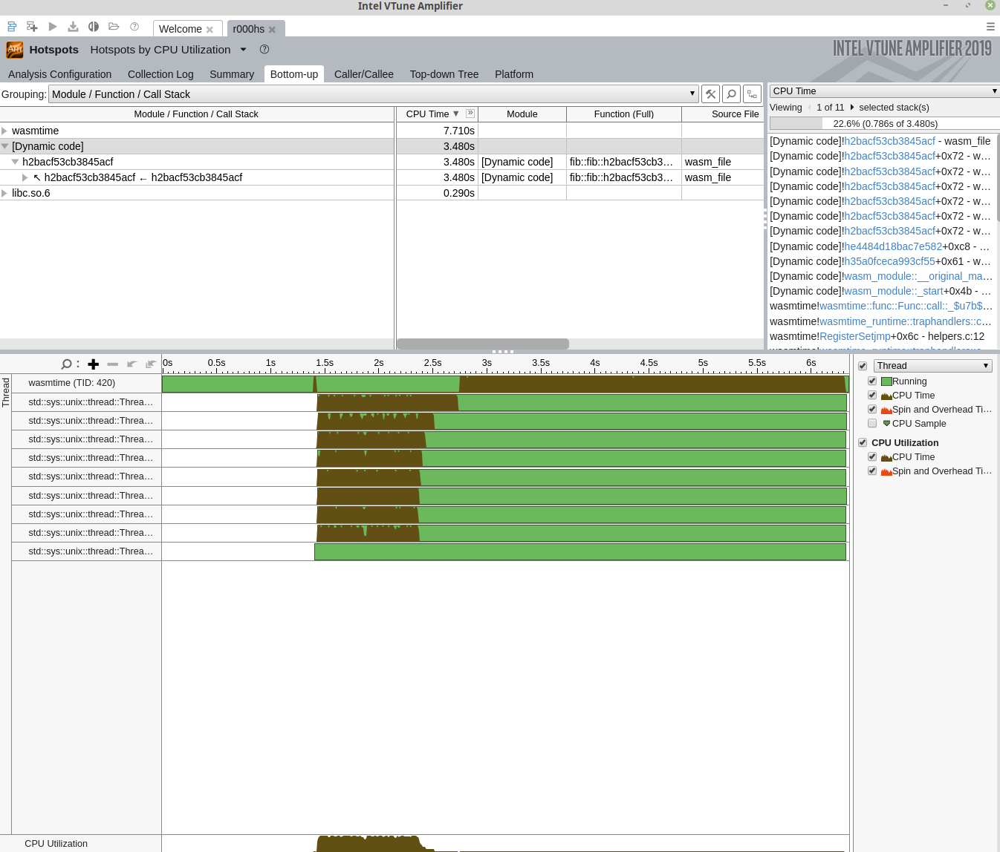

# Using `VTune`

[VTune][help] is a popular performance profiling tool that targets both 32-bit
and 64-bit x86 architectures. The tool collects profiling data during runtime
and then, either through the command line or GUI, provides a variety of options
for viewing and analyzing that data. VTune Profiler is available in both
commercial and free options. The free, downloadable version is available
[here][download] and is backed by a community forum for support. This version is
appropriate for detailed analysis of your Wasm program.

VTune support in Wasmtime is provided through the JIT profiling APIs from the
[`ittapi`] library. This library provides code generators (or the runtimes that
use them) a way to report JIT activities. The APIs are implemented in a static
library (see [`ittapi`] source) which Wasmtime links to when VTune support is
specified through the `vtune` Cargo feature flag; this feature is not enabled by
default. When the VTune collector is run, the `ittapi` library collects
Wasmtime's reported JIT activities. This connection to `ittapi` is provided by
the [`ittapi-rs`] crate.

For more information on VTune and the analysis tools it provides see its
[documentation].

[help]: https://software.intel.com/en-us/vtune-help
[download]: https://software.intel.com/en-us/vtune/choose-download#standalone
[documentation]: https://software.intel.com/en-us/vtune-help
[`ittapi`]: https://github.com/intel/ittapi
[`ittapi-rs`]: https://crates.io/crates/ittapi-rs

### Turn on VTune support

For JIT profiling with VTune, Wasmtime currently builds with the `vtune` feature
enabled by default. This ensures the compiled binary understands how to inform
the `ittapi` library of JIT events. But it must still be enabled at
runtime--enable runtime support based on how you use Wasmtime:

* **Rust API** - call the [`Config::profiler`] method with
  `ProfilingStrategy::VTune` to enable profiling of your wasm modules.

* **C API** - call the `wasmtime_config_profiler_set` API with a
  `WASMTIME_PROFILING_STRATEGY_VTUNE` value.

* **Command Line** - pass the `--profile=vtune` flag on the command line.


### Profiling Wasmtime itself

Note that VTune is capable of profiling a single process or all system
processes. Like `perf`, VTune is capable of profiling the Wasmtime runtime
itself without any added support. However, the [`ittapi`] APIs also provide an
interface for marking the start and stop of code regions for easy isolation in
the VTune Profiler. Support for these APIs is expected to be added in the
future.


### Example: Getting Started

With VTune [properly installed][download], if you are using the CLI execute:

```sh
$ cargo build
$ vtune -run-pass-thru=--no-altstack -collect hotspots target/debug/wasmtime --profile=vtune foo.wasm
```

This command tells the VTune collector (`vtune`) to collect hot spot
profiling data as Wasmtime is executing `foo.wasm`. The `--profile=vtune` flag enables
VTune support in Wasmtime so that the collector is also alerted to JIT events
that take place during runtime. The first time this is run, the result of the
command is a results directory `r000hs/` which contains profiling data for
Wasmtime and the execution of `foo.wasm`. This data can then be read and
displayed via the command line or via the VTune GUI by importing the result.


### Example: CLI Collection

Using a familiar algorithm, we'll start with the following Rust code:

```rust
fn main() {
    let n = 45;
    println!("fib({}) = {}", n, fib(n));
}

fn fib(n: u32) -> u32 {
    if n <= 2 {
        1
    } else {
        fib(n - 1) + fib(n - 2)
    }
}
```

We compile the example to Wasm:

```sh
$ rustc --target wasm32-wasip1 fib.rs -C opt-level=z -C lto=yes
```

Then we execute the Wasmtime runtime (built with the `vtune` feature and
executed with the `--profile=vtune` flag to enable reporting) inside the VTune CLI
application, `vtune`, which must already be installed and available on the
path. To collect hot spot profiling information, we execute:

```sh
$ rustc --target wasm32-wasip1 fib.rs -C opt-level=z -C lto=yes
$ vtune -run-pass-thru=--no-altstack -v -collect hotspots target/debug/wasmtime --profile=vtune fib.wasm
fib(45) = 1134903170
amplxe: Collection stopped.
amplxe: Using result path /home/jlb6740/wasmtime/r000hs
amplxe: Executing actions  7 % Clearing the database
amplxe: The database has been cleared, elapsed time is 0.239 seconds.
amplxe: Executing actions 14 % Updating precomputed scalar metrics
amplxe: Raw data has been loaded to the database, elapsed time is 0.792 seconds.
amplxe: Executing actions 19 % Processing profile metrics and debug information
...
Top Hotspots
Function                                                                                      Module          CPU Time
--------------------------------------------------------------------------------------------  --------------  --------
h2bacf53cb3845acf                                                                             [Dynamic code]    3.480s
__memmove_avx_unaligned_erms                                                                  libc.so.6         0.222s
cranelift_codegen::ir::instructions::InstructionData::opcode::hee6f5b6a72fc684e               wasmtime          0.122s
core::ptr::slice_from_raw_parts::hc5cb6f1b39a0e7a1                                            wasmtime          0.066s
_$LT$usize$u20$as$u20$core..slice..SliceIndex$LT$$u5b$T$u5d$$GT$$GT$::get::h70c7f142eeeee8bd  wasmtime          0.066s
```


### Example: Importing Results into GUI

Results directories created by the `vtune` CLI can be imported in the VTune GUI
by clicking "Open > Result". Below is a visualization of the collected data as
seen in VTune's GUI:




### Example: GUI Collection

VTune can collect data in multiple ways (see `vtune` CLI discussion above);
another way is to use the VTune GUI directly. A standard work flow might look
like:

- Open VTune Profiler
- "Configure Analysis" with
  - "Application" set to `/path/to/wasmtime` (e.g., `target/debug/wasmtime`)
  - "Application parameters" set to `--profile=vtune /path/to/module.wasm`
  - "Working directory" set as appropriate
  - Enable "Hardware Event-Based Sampling," which may require some system
    configuration, e.g. `sysctl -w kernel.perf_event_paranoid=0`
- Start the analysis
