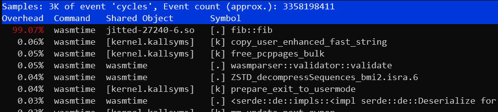
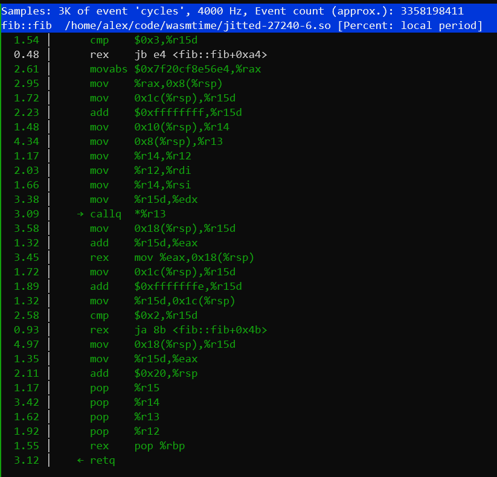

# Profiling WebAssembly

One of WebAssembly's major goals is to be quite close to native code in terms of
performance, so typically when executing wasm you'll be quite interested in how
well your wasm module is performing! From time to time you might want to dive a
bit deeper into the performance of your wasm, and this is where profiling comes
into the picture.

Profiling support in Wasmtime is still under development, but if you're using a
supported profiler this example is targeted at helping you get some more
information about the performance of your wasm.

## Using `perf` on Linux

One profiler supported by Wasmtime is the [`perf`
profiler](https://perf.wiki.kernel.org/index.php/Main_Page) for Linux. This is
an extremely powerful profiler with lots of documentation on the web, but for
the rest of this section we'll assume you're running on Linux and already have
`perf` installed.

Profiling support with `perf` uses the "jitdump" support in the `perf` CLI. This
requires runtime support from Wasmtime itself, so you will need to manually
change a few things to enable profiling support in your application. First
you'll want to make sure that Wasmtime is compiled with the `jitdump` Cargo
feature (which is enabled by default). Otherwise enabling runtime support
depends on how you're using Wasmtime:

* **Rust API** - you'll want to call the [`Config::profiler`] method with
  `ProfilingStrategy::JitDump` to enable profiling of your wasm modules.

* **C API** - you'll want to call the `wasmtime_config_profiler_set` API with a
  `WASMTIME_PROFILING_STRATEGY_JITDUMP` value.

* **Command Line** - you'll want to pass the `--jitdump` flag on the command
  line.

Once jitdump support is enabled, you'll use `perf record` like usual to record
your application's performance. You'll need to also be sure to pass the
`--clockid mono` or `-k mono` flag to `perf record`.

For example if you're using the CLI, you'll execute:

```sh
$ perf record -k mono wasmtime --jitdump foo.wasm
```

This will create a `perf.data` file as per usual, but it will *also* create a
`jit-XXXX.dump` file. This extra `*.dump` file is the jitdump file which is
specified by `perf` and Wasmtime generates at runtime.

The next thing you need to do is to merge the `*.dump` file into the
`perf.data` file, which you can do with the `perf inject` command:

```sh
$ perf inject --jit --input perf.data --output perf.jit.data
```

This will read `perf.data`, automatically pick up the `*.dump` file that's
correct, and then create `perf.jit.data` which merges all the JIT information
together. This should also create a lot of `jitted-XXXX-N.so` files in the
current directory which are ELF images for all the JIT functions that were
created by Wasmtime.

After that you can explore the `perf.jit.data` profile as you usually would,
for example with:

```sh
$ perf report --input perf.jit.data
```

You should be able to annotate wasm functions and see their raw assembly. You
should also see entries for wasm functions show up as one function and the
name of each function matches the debug name section in the wasm file.

Note that support for jitdump is still relatively new in Wasmtime, so if you
have any problems, please don't hesitate to [file an issue]!

[file an issue]: https://github.com/bytecodealliance/wasmtime/issues/new

### `perf` and DWARF information

If the jitdump profile doesn't give you enough information by default, you can
also enable dwarf debug information to be generated for JIT code which should
give the `perf` profiler more information about what's being profiled. This can
include information like more desriptive function names, filenames, and line
numbers.

Enabling dwarf debug information for JIT code depends on how you're using
Wasmtime:

* **Rust API** - you'll want to call the [`Config::debug_info`] method.

* **C API** - you'll want to call the `wasmtime_config_debug_info_set` API.

* **Command Line** - you'll want to pass the `-g` flag on the command line.

You shouldn't need to do anything else to get this information into `perf`. The
perf collection data should automatically pick up all this dwarf debug
information.

### `perf` example

Let's run through a quick example with `perf` to get the feel for things. First
let's take a look at some wasm:

```rust
fn main() {
    let n = 42;
    println!("fib({}) = {}", n, fib(n));
}

fn fib(n: u32) -> u32 {
    if n <= 2 {
        1
    } else {
        fib(n - 1) + fib(n - 2)
    }
}
```

To collect perf information for this wasm module we'll execute:

```sh
$ rustc --target wasm32-wasi fib.rs -O
$ perf record -k mono wasmtime --jitdump fib.wasm
fib(42) = 267914296
[ perf record: Woken up 1 times to write data ]
[ perf record: Captured and wrote 0.147 MB perf.data (3435 samples) ]
$ perf inject --jit --input perf.data --output perf.jit.data
```

And we should have all out information now! We can execute `perf report` for
example to see that 99% of our runtime (as expected) is spent in our `fib`
function. Note that the symbol has been demangled to `fib::fib` which is what
the Rust symbol is:

```sh
$ perf report --input perf.jit-data
```



Alternatively we could also use `perf annotate` to take a look at the
disassembly of the `fib` function, seeing what the JIT generated:

```sh
$ perf annotate --input perf.jit-data
```



[`Config::debug_info`]: https://bytecodealliance.github.io/wasmtime/api/wasmtime/struct.Config.html#method.debug_info
